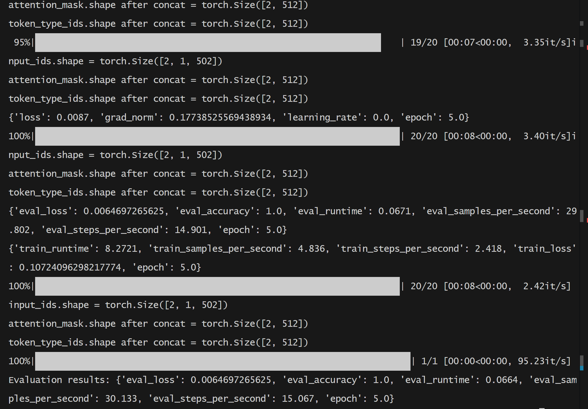
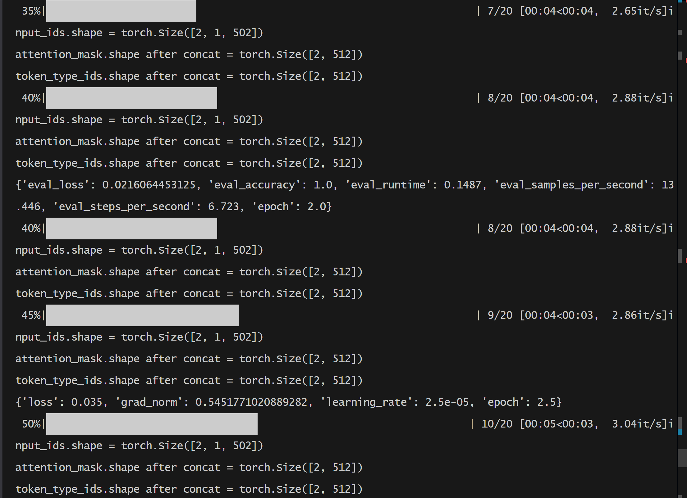

# 基于LoRA和Auto-CoT的双向prompt-tuning微调方法
# BlackPrompt: A Bidirectional and LoRA enhanced Auto-Chain-of-Thought-K-Means Style prompt-tuning system For multiple choice question answering

---

## Background
- 由于受到《Pretrained Prompt-Tuning》在**使用预训练来初始化prompt tokens**后大幅提高prompt-tuning性能的影响，我们希望找到一种方法，它不需要预训练prompt-tokens，而是仅仅通过使用AutoCoT生成对应问题的推理步骤，并且将这些步骤(steps)以某种方式(clustering)转化为tokens加到原始prompt的后面，来使此种方法的MCQ问答性能超越pre-trained prompt-tuning,并且所使用的显存和算力也大幅降低，更加适用于low-resource的教学场景。 


- prompt 分为hard prompt 和 soft prompt
- 我们会把Auto-Cot的steps处理成一种称为 `semi-hard prompt` 的东西： 由于这些token不是训练得到的，因此他们不是连续的continuous tokens， 他们的本质是从推理步骤中直接拿出来的hard tokens, 再对这些hard tokens取平均。
  
- 但是从过往的经验看，soft-prompt的性能往往超越hard-prompt, 因此我们希望在此基础上prompt-tokens的部分进行微调，目的是在hard-prompt的基础上增加连续性。


---

## Architecture Overview
The system integrates bidirectional prompt-tuning, Auto Chain-of-Thought (Auto-CoT), Named Entity Recognition (NER), K-means clustering, and LoRA to enhance multiple-choice question answering performance.

---

## System Components:
1. Input Question:  
  1. a multiple-choice question [context + question + candidate items].
2. Bidirectional Prompt-Tuning:
  - Prefix Prompt Tokens: Add K trainable tokens at the beginning of the model input.
  - Suffix Prompt Tokens: Add K trainable tokens at the end of the model input. The latest 5 tokens represent the classification of the question. (this is done by a few-shot classification model)
  - Normally, the Prefix and Suffix tokens should be initialized during pre-training, however, due to the lack of strong computing power and the intrinsic limitation of the pre-train-initialization, we prepare to initilize the prefix and suffix prompt tokens using the output reasoning steps from the Auto-CoT module.
3. Auto Chain-of-Thought (Auto-CoT):
  - Generates intermediate reasoning steps to an MCQ question.
  - The Auto-CoT generated reasoning steps will be further processed by the NER and K-means module to  retrieve the 5 trainable prompt tokens used for forward prompt-tuning.
4. Named Entity Recognition (NER):
  - Applies NER to recognize all reasoning step strings from the Auto-CoT output.
  - Extracts meaningful entities representing reasoning steps.
  - For example, we finally get 1000 entities, each is represented by a word embedding.
5. K-Means Clustering:
  - Identifies K reasoning steps from the extracted entities.
  - Clusters the word embeddings of all reasoning steps into K clusters using the K-means algorithm.
  - Performs average pooling on each cluster to obtain K pooled vectors.
6. Pooled K Vectors:
  - The pooled vectors serve as the final K trainable forward prompt tokens for the model.
7. LoRA Integration:
  - Incorporates Low-Rank Adaptation (LoRA) into the system to efficiently fine-tune the large language model without updating all parameters.
8. Language Model Processing:
  - The modified input, enriched with bidirectional prompt tokens and optimized via LoRA, is fed into the language model.
  - The model processes the input to generate the answer.
9. Output Answer:
  - The system outputs the answer to the multiple-choice question.

---

## System Sketch


## current idea
1. remove the lora part, replace it with a "Attention Router Module"
2. Dual Attention
3. shareable attention
4. 随着项目的进展，我们会在Auto-CoT steps的处理上加上若干细节
  - 我们通过对AutoCoT的结果进行NER，会产生很多steps, 比如说100个。
  - 原始的办法是将这些steps聚成5类，每一类取均值向量，成为5个tokens，再加到prompt后面。
  - 能否计算100个steps和question之间的注意力分数，再使用这个分数来生成一个context vector。把这个vector作为最后的prompt token。
  - 或者，每个任务（dataset）训练一个单独的bidirectional prompt embedding. 比如说，10个embeddings。然后使用attention来选择top-3个最重要的


## 头脑风暴
以下是5种可以将这10个任务特定的双向Prompt Embedding整合的方法，以防止灾难性遗忘，并在大部分MCQ任务（如RACE、medQA、SQuAD）上超越之前的高效微调方法。

1. **注意力加权的上下文向量整合**：计算每个Embedding与当前问题之间的注意力分数，利用这些分数对Embeddings进行加权求和，生成一个上下文向量，作为最后的Prompt Token。这种方法可以让模型关注与当前问题最相关的知识，减少灾难性遗忘的影响。

2. **任务特定Embedding的选择与融合**：为每个任务（数据集）训练一组独立的双向Prompt Embedding，例如10个Embeddings。在推理时，使用注意力机制计算当前问题与每个任务Embedding的相关性，选择Top-3最重要的Embeddings进行融合。这有助于模型在不同任务之间共享信息，同时保持任务特定性。

3. **硬注意力任务路由**：采用硬注意力机制，将不同任务的Embeddings路由到对应的任务处理中，类似于“通过对任务的硬注意力克服灾难性遗忘”的方法1。通过明确的任务路由，可以减少不同任务之间的干扰。

4. **基于注意力的Prompt融合网络**：构建一个小型的网络，学习如何根据当前问题动态地组合这10个Embeddings。该网络使用注意力机制，对Embeddings进行加权组合，生成最终的Prompt Embedding。这种方法能够自适应地融合任务之间的知识。

5. **连续学习与正则化**：在训练过程中，加入正则化项，限制新任务训练时对已有Embeddings的更新幅度，防止模型过度调整，从而避免灾难性遗忘。这与连续学习领域中的方法类似，可以参考相关研究2。

6. **Orthogonal Embedding Decomposition**: Decompose each task-specific embedding into orthogonal components to minimize interference. Combine them into a unified prompt embedding that preserves unique task features while reducing overlap.

7. **Dynamic Memory Networks with Prompt Embeddings**: Implement a dynamic memory network that stores each prompt embedding in memory slots. Use a gating mechanism to read and write to these slots based on the input question.

8. **Attention over Attention Mechanism**: Introduce a second-level attention mechanism that not only attends over the prompt embeddings but also considers the attention distributions themselves, enhancing the selection process.

9. **Semantic Clustering of Prompt Embeddings**: Cluster prompt embeddings based on semantic similarity and create cluster representations. Use these representations to guide the integration of embeddings for related tasks.


## 实验配置
### 模型
1. qwen2
2. llama3
3. bert-base-uncased
4. GPT4o


### 评价指标
在评估模型在多项选择题回答任务上的性能时，常用的评价指标由以下几种：

1. **准确率（Accuracy）**：这是最常用的指标，尤其在多项选择题任务中。准确率定义为正确预测的数量与总预测数量的比率。公式为：
   $$ \text{Accuracy} = \frac{\text{Number of Correct Predictions}}{\text{Total Number of Predictions}} $$

2. **精确率（Precision）** 和 **召回率（Recall）**：这两个指标通常在多标签分类问题或模型需要在正负样本之间做权衡时使用。对于单选题的任务中，这些指标很少单独使用，但可以用于分析模型对于某一类别的判断能力。

3. **F1得分（F1 Score）**：是精确率和召回率的调和平均。它常用于需要兼顾精确度和覆盖度的场景中。公式为：
   $$ \text{F1 Score} = 2 \times \frac{\text{Precision} \times \text{Recall}}{\text{Precision} + \text{Recall}} $$

4. **Top-K准确率（Top-K Accuracy）**：在多个选项中，预测答案在前K个最可能的选项中即视为正确。这对于选项数量较多的多选题，或在模型使用时允许有多种答案时，特别有用。

5. **平均精度（Mean Reciprocal Rank，MRR）**：评估系统返回一个排序列表结果的准确性，即正确答案（通常是某一类的概率最大的样本）是否位于前几个中。公式为：
   $$ \text{MRR} = \frac{1}{N} \sum_{i=1}^{N} \frac{1}{\text{rank}_i} $$
其中 $$ \text{rank}_i $$ 表示正确答案在第i次查询的排序中的排名。


参考:
- [Evaluating QA: Metrics, Predictions, and the Null Response](https://qa.fastforwardlabs.com/no%20answer/null%20threshold/bert/distilbert/exact%20match/f1/robust%20predictions/2020/06/09/Evaluating_BERT_on_SQuAD.html)
- [Evaluation metrics for multiple correct answers in QA problem system](https://stackoverflow.com/questions/64112565/evaluation-metrics-for-multiple-correct-answers-in-qa-problem-system)
- [NLP Question Answering Mastery: Evaluation Metrics and Methods](https://gpttutorpro.com/nlp-question-answering-mastery-evaluation-metrics-and-methods-for-question-answering/)

## 生成 `requirements.txt` 文件
```shell
pipreqs . --force
```

## 推送项目到仓库
```shell
git add .
# 先将大文件移出暂存库
git rm -rf --cached save data ... 文件夹名
# 检查暂存库的内容
git status
```

- 然后在项目目录中创建一个.gitignore 文件，内容如下：

```text
\save\
\data\
```

```shell
git add .gitignore
git commit -m 'add .gitignore'
git push
```

- 如果还不行，需要下额外的包：

```shell
pip install git-filter-repo

# 使用 git filter-repo 移除大文件  
git filter-repo --strip-blobs-bigger-than 20M  

git remote add origin <远端仓库地址>
git push origin --force  

# 如果没有同步远端，则：
git push --set-upstream origin main --force
```

## 运行项目
main.py

## 训练流程





## 实验结果


| Method       | Dataset |   Model  | Accuracy | Precision | Recall | F1 Score |  
|--------------|---------|----------|----------|-----------|--------|----------|  
| LoRA         | RACE    |          | 0.86     | 0.85      | 0.84   | 0.85     |  
               | MedQA   |          | 0.78     | 0.77      | 0.76   | 0.77     |  
               | SQuAD   |          | 0.82     | 0.81      | 0.80   | 0.81     |  
| AdaLoRA      | RACE    |          | 0.88     | 0.87      | 0.86   | 0.87     |  
| AdaLoRA      | MedQA   |          | 0.80     | 0.79      | 0.78   | 0.79     |  
| AdaLoRA      | SQuAD   |          | 0.85     | 0.84      | 0.83   | 0.84     |  
| DoRA         | RACE    |          | 0.85     | 0.84      | 0.83   | 0.84     |  
| DoRA         | MedQA   |          | 0.77     | 0.76      | 0.75   | 0.76     |  
| DoRA         | SQuAD   |          | 0.81     | 0.80      | 0.79   | 0.80     |  
| Prompt-Tuning | RACE   |          | 0.83     | 0.82      | 0.81   | 0.82     |  
| Prompt-Tuning | MedQA  |          | 0.75     | 0.74      | 0.73   | 0.74     |  
| Prompt-Tuning | SQuAD  |          | 0.79     | 0.78      | 0.77   | 0.78     |  
| P-Tuning     | RACE    |          | 0.84     | 0.83      | 0.82   | 0.83     |  
| P-Tuning     | MedQA   |          | 0.76     | 0.75      | 0.74   | 0.75     |  
| P-Tuning     | SQuAD   |          | 0.80     | 0.79      | 0.78   | 0.79     |
| P-Tuning v2  | RACE    |          | 0.85     | 0.84      | 0.83   | 0.84     |
| P-Tuning v2  | MedQA   |          | 0.77     | 0.76      | 0.75   | 0.76     |
| P-Tuning v2  | SQuAD   |          | 0.81     | 0.80      | 0.79   | 0.80     |
| BlackPrompt  | RACE    |          | 0.85     | 0.84      | 0.83   | 0.84     |
| BlackPrompt  | MedQA   |          | 0.77     | 0.76      | 0.75   | 0.76     |
| BlackPrompt  | SQuAD   |          | 0.81     | 0.80      | 0.79   | 0.80     |


