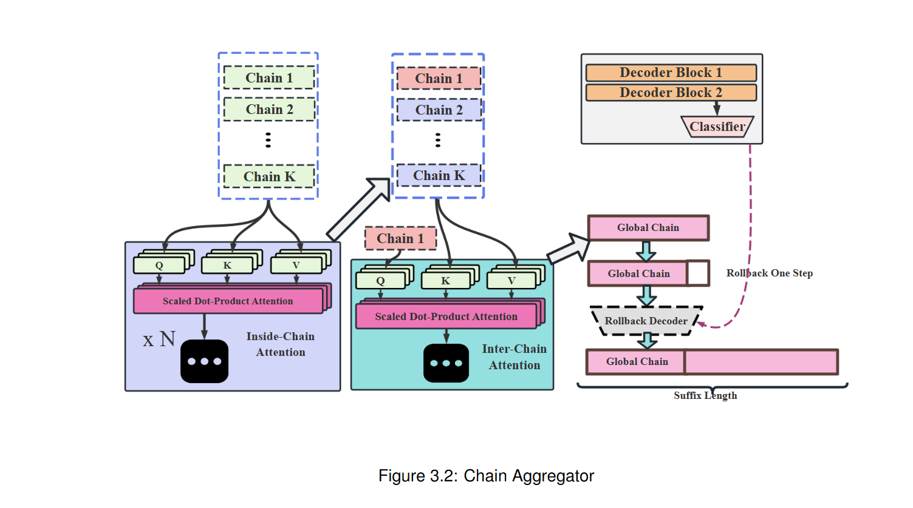
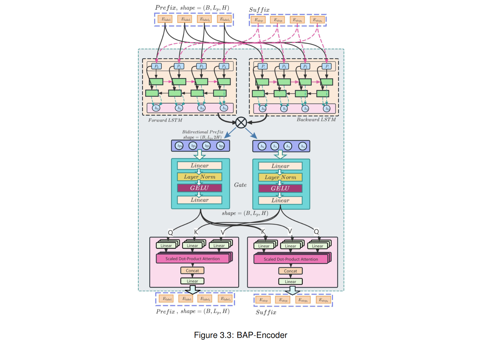

# 《BaasPrompt: A Bidirectional Attention-Aggregated and Reasoning-Step-Injected Prompt-Tuning System For Multiple-Choice Question Answering》

- 论文初稿
---

## Background
- 由于受到《Pretrained Prompt-Tuning》在**使用预训练来初始化prompt tokens**后大幅提高prompt-tuning性能的影响，我们希望找到一种方法，它不需要预训练prompt-tokens，而是仅仅通过使用AutoCoT生成对应问题的推理步骤，并且将这些步骤(steps)以某种方式(clustering)转化为tokens加到原始prompt的后面，来使此种方法的MCQ问答性能超越pre-trained prompt-tuning,并且所使用的显存和算力也大幅降低，更加适用于low-resource的教学场景。 


---
## Contributions:
We propose a novel bidirectional prompt tuning method that injects a pair of jointly aligned prefix and suffix embeddings into the input layer of the model to from a prompt template of **`[Prefix;Input;Suffix]`**. Where the prefix is initialized using the topic labels from the training set and the suffix are initialized using a global reasoning chain is marged from $K$ local chains using a **`Chain Aggregator`** . This new method can be comparable or surpass all of the prompt-based baselines (Lester et al. 2021;
Li and Liang 2021; Liu et al. 2024; Liu et al. 2021) on the Bert model series, leading by a largest margin of 8.1 average F1 points without relying on pre-trained soft tokens (Gu et al., 2021).

We also introduce a new reparameterization encoder called **`BAP-Encoder`** that can leverage a pair of Bi-LSTMs to bidirectionally encode the prefix and suffix separately and use a cross-attention to jointly align the prefix and suffix to mitigate the deviation and inconsistency toward the task content.

We demonstrate that BaasPrompt outperforms existing single-layer prompt-based methods (Lester
et al. 2021; Liu et al. 2024) on all the experimented MCQ datasets, with a largest gap of 32.1-points of precision and 29-points of F1 on the SciQ, and can also be comparable to or even execeed the deep prompting method like prefix-tuning (Li and Liang, 2021) and p-tuning v2 (Liu et al., 2021).

---

## 论文大纲
本论文提出了一种名为Baas-Prompt的参数高效微调方法，旨在解决传统提示调优方法的三大核心问题：前缀可训练token的任务无关性、前缀内容对于当前输入问题的推理过程的无关性，和前缀的长依赖建模不足。通过解决这3大问题，我们为可训练的前缀找到了一个高质量的初始化点，以下是核心创新点：

### 1. 双向的输入prompt设计

模板形式：`[Prefix; Input; Suffix]`

前缀（Prefix）：通过主题词初始化（Topic Initialization）给前缀注入任务相关的语义（如RACE任务中可能包含"science", "finance"等主题词），替代传统的随机/类别标签初始化【例如prompt-tuning中描述的】。
后缀（Suffix）：通过全局推理链（Global Chain）注入任务推理逻辑，模仿人类逐步推理过程。
对比传统方法：

传统方法仅使用前缀[Prefix; Input]，且prefix中的初始化内容与当前的任务（如随机初始化的类标签A,B,C,D与具体的RACE数据集中的英语阅读理解文章内容无关），导致模型收敛慢且性能较差。

### 2. 前缀初始化方法

文本提出三种主题词提取技术生成高质量前缀，为后续的前缀训练提供了一个良好的初始化点：

聚类提取：用Sentence-BERT编码训练集，通过K-Means聚类后选取与簇中心最接近的词。
LDA提取：通过主题模型挖掘训练集中的潜在主题词。
TF-QDF-VS提取：结合词频、查询分布频率和 词表-语料 相似度 筛选主题词 【The TF-IQF-VS is a score that calculatded by multiplying the Term-Frequency, Query-Distribution-Frequency,  and the Vocab-Corpus-Similarity together, used to extract a bunch of topic words from a given training set  (e.g., RACE)】。
优势：

相比传统方法，主题词与任务强相关，提供更优的prefix token训练初始化起点 （灵感来自Prompt-Tuning + Pretrained Prompt-Tuning）

### 3. 后缀推理链生成

通过Auto-CoT模块,和一个基于Hierarchical Attention的链聚合器 (Chain Aggregator) 构建全局推理链 (Global Chain)：

#### Auto-CoT模块：
将训练集(e.g., RACE )中的样本聚类后，从训练集的 K 个不同聚类中通过一个criterion来挑选K个question，最后使用GPT-4o和“Let's think step by step” 提示词来生成 K 条不同的推理链 ($T = [Q : q(i), A : r(i) ◦ a(i)]$, where i=1~K, and Q is a question, A is the trigger string "Let's think step by step", r is the rationale (reasoning chain), and a is the final answer)，随后这 K 条推理链 (T) 会被作为大模型gpt-4o的prompt中的 Fewshot examples, 然后我们再从K个聚类中随机挑选K个question $[q^{(1)}_t , ..., q^{(K)}_t ]$ ("t" 代表 "test", 也是模型真正要回答的当前样本中的问题)，其中的每个问题要进一步分别和之前的K个 few-shot examples 以及 trigger string 共同组成一个prompt ($[Q : q^{(i)}_t ; d(1), ..., d(K); A : Trigger]$) 输入gpt-4o, 最后我们会得到总共K个reasoning chains: $[r^{(1)}_t ; a^{(1)}_t ], ..., [r^{(k)}_t ; a^{(K)}_t ]$, 我们保留其中的rationale部分：$[r^{(1)}_t , ..., r^{(K)}_t]$， 每条推理链（`rationale`）会进一步被分为K个推理步骤(`step`), 从而形成一个 `step list`：$[s^{(i)}_1 , ..., s^{(i)}_n], where \ n = min(r^{(i)}_t )$， 其中每个推理步骤随后会被`sentence-bert`转为embedding，然后整个step-list中的所有embedding会被合并为一个大的`reasoning chain embedding` $CH_i$, 所以最终会得到K个`reasoning chain embedding`：$[CH_1, ...,CH_K]$，然后所有的 $CH$ 将被`Chain Aggregator`合并为一条全局链（Global Chain），以 **初始化 Baas-Prompt 输入层的后缀标记**，这些标记在后续的提示调优阶段是可训练的。


#### 链聚合器 (Chain Aggregator)：
- 核心机制：Hierarchical Chaining Attention. 链式注意力旨在创建一个聚合的全局链，该链假定通过捕捉这 K 个链之间的局部-全局模式来发现。这种局部-全局模式表明了两种级别的依赖关系，包括链内依赖(inside-chain dependency)和链间依赖(inter-chain dependency)。
- 层内注意力(Inside-Chain Level Dependency)：捕捉单条推理链的步骤间依赖。
  - we use the Self-Attention to model the relationship between each pair of reasoning steps inside one chain and get a deeper chain representation called $CHS_i ∈ R^{n×H}$ for each $CH_i$,  where this modeling contains two attention block, with each one has the following procedure:  
    - $M_{CH} = stack([CH_i, ...,CH_K])  $
    - $Q = M_{CH} ·W^Q, K = M_{CH} ·W^K,V = M_{CH}·W^V  $
    - $Attention(Q, K,V ) = softmax( \frac{QK^T}{√d_k})V  $
    - $M_{CHS} = Attention(Q, K, V)  $
  - After the processing, we can get a combined matrix $M_{CHS}$ of all K chains $CHS_i$, with each of them being deeply modeled a `step-wise dependency` between any pair of reasoning steps. 
- 层间注意力(Inter-Chain Level Dependency)：融合多条推理链的共性模式，生成全局推理链。
  - 采用主链引导的跨链注意力聚合
  - 以堆叠的链表示矩阵$M_{CHS}$（尺寸：K×L×d）为输入
  - 设定第一链$CHS_0$作为主查询（Q），其他K-1链作为键值对（K/V） 
  - 数学实现：
```python
Q = CHS_0 @ W_Q  # 主链特征投影 (L×d → L×d_k)
K = M_CHS @ W_K  # 全链键投影 (K×L×d → K×L×d_k)
V = M_CHS @ W_V  # 全链值投影 

M_CHG = softmax(Q·K^T/√d_k) @ V  # 跨链注意力映射
CHA = mean_pooling(M_CHG)  # 全局特征压缩

```


示例：
对于数学题，全局推理链可能包含"识别问题类型→提取已知量→选择公式→计算验证"的通用步骤。

#### Rollback Policy:
- 这样的一条全局链会遇到一个问题，即其长度与Baas-Prompt的后缀长度不兼容。具体来说，有三种情况：
  - (A). Reasoning Steps (n) < Suffix Length.  
  - (B). Reasoning Steps (n) = Suffix Length.  
  - (C). Reasoning Steps (n) > Suffix Length.


- 对于情况 A，我们首先引入了一种“回退一步”（Roll-Back-One）策略，该策略将剩余的 n − 1 步作为输入，并使用额外构建的“回退解码器”（Roll-Back Decoder）执行因果语言建模任务，从而将推理步骤扩展到指定的后缀长度 $L_{suffix}$。该策略的目标是将不确定性引入推理过程。随着模型逐渐接近全局链条的终点，其预测通常会变得更加确定。通过在链条中回退一步，模型被进一步远离结论，从而在其推理结果上获得更大的灵活性。

- 对于情况 B，没有任何修改；
- 对于情况 C，我们不采用任何策略，只是简单地将全局链条截断到后缀的长度。


#### Rollback Decoder 模块：
这是一个双层自回归模型，设计用于预测下一个推理步骤，直到全局推理链条达到指定的后缀长度。在回退解码器内部，包含三个关键组件：(1) 两个解码器层，每个层都实现为标准的多头注意力块；(2) 一个分类器。分类器将解码器输出的最终隐藏状态映射到基础模型词汇表中的一个标记（token）。这个预测的标记随后被视为下一个推理步骤。


### 1. 双向对齐编码器（BAP-Encoder）用于重参数化（Reparameterization）

传统问题：

前缀和后缀的嵌入表示在反向传播过程中独立优化，可能导致语义偏移（如前缀描述主题，后缀描述推理步骤，两者不一致）。而在论文“P-Tuning” 中提到的重参数化技术（Reparameterization）可以通过引入一个额外的encoder来生成前缀嵌入，以此来保持训练过程中的稳定性，但在“P-Tuning V2”的工作中又证明reparameterization对于某些任务可能是多余的。因此，我们希望改进 Reparameterization，提出了BAP-Encoder 以确保前缀和后缀的语义一致性，以及可以在一定程度上提升模型在多项选择任务中的性能。

解决方案：

本段论文介绍了一种名为 BAP-Encoder (Bidirectional and Attentional Prompt Encoder) 的再参数化技术，用于提升大语言模型的提示学习性能。它使用双向LSTM分别编码前缀和后缀的上下文信息。
通过门控跨注意力机制联合对齐（jointly align）两者的表示，确保语义一致性。

核心创新点

1. **双向依赖建模**：使用一对双层双向LSTM (前向和后向) 捕获提示内文本依赖关系，生成双向上下文表示。

2. **前缀与后缀对齐**：通过多头交叉注意力机制，实现前缀和后缀之间的双向信息对齐，解决了之前工作中提示编码器无法保持前后缀一致性的问题。

技术实现

- **双向LSTM处理**：
  - 输入前缀通过前向LSTM和后向LSTM分别处理: $P_{forward} ∈ R^{B×L_P×H}, P_{forward} ∈ R^{B×L_P×H}$
  - 将两个输出拼接为 $[P_{forward} ; P_{backward} ] ∈ R^{B×L_P×2H}$，并通过门控机制整合，得到$P_{bidirectional} ∈ R^{B×L_P×H}$
  - 对后缀执行相同操作得到$S_{bidirectional}$

- **交叉注意力对齐**：
  - 前缀→后缀对齐：$P_{bidirectional}$作为Query，$S_{bidirectional}$作为Key和Value
  - 后缀→前缀对齐：反向执行上述过程
  - 结果表示中的每个元素$e_{i,j}$表示前缀中第i个token与后缀中所有token在第j维度的关联。这意味着前缀中的每个标记在某些特定维度上与后缀中的每个标记对齐。

## Rollback Half-N策略

- 与Rollback-One策略类似，但更为灵活
- 后缀对齐后被截断为原长度的一半
- 使用Rollback Decoder递归预测词汇表中的下一个token，直到恢复原始长度
- 目的是为推理过程引入适当的不确定性，提高模型推理准确性

这种方法本质上强化了提示表示的双向上下文理解能力，并通过前缀-后缀互相对齐和回滚策略优化了模型生成过程。


### 实验设置

#### 4.1 实验设置概述

BaasPrompt论文进行了大规模实验，旨在通过与其他提示学习方法（如prompt-tuning、prefix-tuning、p-tuning和p-tuning v2）的比较，验证该方法在多项选择题问答(MCQA)任务上的性能。实验涉及三种不同架构的预训练模型（编码器型、编码器-解码器型和解码器型）以及四种不同的MCQA任务。

#### 4.1.1 MCQA任务数据集

论文使用了四个代表性的多项选择题数据集来验证BaasPrompt的自然语言理解能力、综合理解能力和推理能力：

1. **RACE**：来自中国高中和初中英语考试的阅读理解数据集，旨在测试模型的阅读理解能力，包括语法和语义层面的理解、段落间信息提取以及多句和远程推理能力。由于其极长的上下文（平均文章长度291个词），被视为推理能力的指标。

2. **SciQ**：（论文中未完整展示其细节）

3. **DREAM**：（论文中未完整展示其细节）

4. **CommonsenseQA**：（论文中未完整展示其细节）

#### 4.1.3 预训练模型

实验使用了多种预训练模型，涵盖：
- 编码器型模型（如BERT系列）
- 解码器型模型（如GPT2）


#### 4.1.4 实验设备

- 对于参数比例低于0.1%的提示学习方法，使用4×V100 GPU（每个32GB内存）
- 对于参数比例明显高于0.1%的方法，使用4×H20 GPU（每个96GB内存）
- 通过huggingface提供的Accelerate库构建分布式训练环境 (完全手搓所有的训练循环，没有使用transformers库中的trainer类，没有使用deepspeed等高级框架)

#### 4.1.5 基线方法

论文包含四种提示学习基线作为BaasPrompt的竞争对手：

1. **Prompt-Tuning** (Lester et al., 2021)：
   - 在输入嵌入开头添加连续提示标记，并截断原始输入
   - 提示长度设为100
   - 提示内容初始化为"Classify the answer of this question among A, B, C, and D"

2. **Prefix-Tuning** (Li and Liang, 2021)：
   - 在每个Transformer层的KV矩阵开头添加连续提示标记，保持Q矩阵不动，不截断原始输入
   - 提示长度为100，学习率为1×10^-5
   - 优化器使用AdamW，使用MLP进行重参数化

3. **P-Tuning** (Liu et al., 2024)：
   - 在输入嵌入中交错连续提示标记，并截断原始输入
   - 学习率为0.3，前缀长度为100

4. **P-Tuning V2** (Liu et al., 2021)：
   - P-tuning v2 和 Prefix-tuning 实际上本质上是相同的方法
   - Prefix-tuning 主要关注自然语言生成(NLG)任务，而 P-tuning v2 在自然语言理解(NLU)任务上表现更佳
   - 在参数效率方面，P-tuning v2 比 Prefix-tuning 更有效率
   - 两者都在模型的多个层添加可训练参数：
     - P-tuning v2 也是在"所有 Transformer 层的键和值矩阵上预置（prepend）可训练的前缀向量"文献 28 明确指出："prefix-tuning [16] and P-tuning-v2 [20] prepend trainable prefix vectors to keys and values matrices at all transformer layers"


## 4.1.6 默认配置

BaasPrompt的默认配置如下：

- **前缀长度**：10（遵循Li and Liang 2021）
- **后缀长度**：基础模型最大序列长度的10% [可选：1%、5%、10%、20%]
- **提示位置**：默认仅在输入层，除非进行消融实验
- **学习率**：0.3（遵循Lester et al., 2021）
- **训练轮数**：10（遵循Li and Liang 2021）
- **Dropout**：0.1（遵循Liu et al. 2021）
- **梯度累积步骤**：32
- **梯度归一化类型**：L2归一化
- **最大梯度范数**：1.0
- **学习率调度器**：线性学习率调度器
- **预热步骤**：500

BaasPrompt的可训练参数比例为0.03%（包括前缀和后缀嵌入、线性分类头以及BAP-Encoder中的参数）。在全层模式（消融研究中添加每个注意力层的XK、XV矩阵参数）下，参数比例达到3.86%。

所有比较方法的训练最多进行22K步（遵循Li and Liang的设置），使用开发集上的最佳准确率、精确度、召回率和F1分数作为评估指标。


### 核心实验结果：

BaasPrompt论文在多种预训练模型架构（编码器型、解码器型）和多项选择题问答(MCQA)任务上进行了广泛实验，以评估其与现有提示学习方法的比较性能。

#### 1. 编码器模型实验结果

**与单层提示方法的比较**：
- BaasPrompt在所有基准测试中一致优于Prompt-Tuning：
  - BERT-Base上提高8.1个百分点
  - BERT-Large上提高2个百分点
  - 对比P-tuning，在BERT-Base上领先5.6个百分点，在BERT-Large上领先1.4个百分点
  - 在RoBERTa-Large上略低于Prompt-Tuning，但仍具有竞争力

**与深层提示方法的比较**：
- 与深层提示方法相比，BaasPrompt也表现出色：
  - 与Prefix-Tuning相比最小差距为0.9个百分点
  - 最大超过P-tuning v2达6.8个百分点

**特定任务表现**：
- 在复杂推理任务（如SciQ）上，Prefix-Tuning表现最优
  - 在BERT-Base上比P-tuning v2高36.2个百分点
  - 在BERT-Large上高36.4个百分点
- 然而，BaasPrompt在SciQ上达到0.739的性能，将差距缩小至5个百分点
- 在RoBERTa-Large上，BaasPrompt在SciQ任务上远低于Prefix-Tuning
- 在CommonsenseQA任务上，BaasPrompt领先Prefix-Tuning达31个百分点

#### 2. 解码器模型实验结果

- 较小规模模型(GPT2-124M)：
  - BaasPrompt性能落后，与Prefix-Tuning相比最大差距为6.7个百分点
  - 在RACE任务上比Prompt-Tuning落后19.4个百分点

- 较大规模模型(GPT2-Medium, 355M)：
  - BaasPrompt超过所有基线方法，领先P-tuning 8.3个百分点
  - 展现出明显的模型规模扩展效应

#### 3. 跨架构和跨任务性能

- BaasPrompt在不同架构上都展现出竞争性能
- 在RACE和CommonsenseQA基准测试上表现尤其出色：
  - 在RACE上领先P-tuning 8个百分点，领先Prefix-tuning 5个百分点
- 在科学概念理解（SciQ）上性能相对较弱

#### 4. 规模扩展效应

- 解码器模型随着规模增大，BaasPrompt性能显著提升
- 在DREAM和CommonsenseQA任务上，从GPT2-124M到GPT2-Medium的性能提升最为明显
- 编码器模型从1.1B到3.4B没有明显的规模效应

#### 消融研究

##### 1. 提示长度研究

- 设置后缀长度为最大输入长度的不同比例：1%、5%、10%、20%、50%
- 结论：
  1. 后缀长度为最大序列长度10%时性能最佳
  2. 50%的后缀比例甚至不如1%的比例，表明过度扩展会损害性能
  3. 编码器模型从1.1B到3.4B没有显著的规模效应
  4. 解码器模型随规模增大表现出性能提升趋势

##### 2. 前缀初始化方法研究

比较了三种前缀初始化方法：LDA、TF-QDF-VS和聚类方法
- 结论：
  1. 聚类方法在四种模型规模中的三种上表现最佳，显示出强适应性
  2. 与后缀长度研究结果类似，在解码器模型上规模效应明显

#### 局限性与未来工作

1. **小模型性能**：BaasPrompt在小型解码器模型上表现较弱，如在RACE数据集上与Prompt-Tuning相比有19.4个百分点的差距。

2. **计算开销**：BAP-Encoder的双向LSTM对和交叉注意力模块引入额外GPU内存消耗，相比简单的重参数化方法（如MLP和嵌入）训练负担较重。

3. **缺乏全面消融研究**：论文未深入调查不同重参数化方法（MLP、EMB、LSTM、BAP-Encoder）的影响，难以确定性能提升来源于BAP-Encoder还是全局推理链。

4. **其他挑战**：
   - 链生成成本：使用GPT-4o等闭源模型生成K个链成本高
   - 弱链聚合器：层次链注意力设计过于粗粒度
   - 内存需求：双向提示模式需要较大内存，在H20 GPU上也只能允许小批量（2）训练
   - 多任务训练：后缀中的全局链是针对特定下游任务初始化的，可能无法很好地跨MCQA基准传输

论文表明BaasPrompt在多种模型架构和数据集上优于现有提示学习方法，特别是在复杂推理任务上，同时保持较低的参数需求，适合教育等资源有限的环境。


### 开源代码地址
【github】: https://github.com/NJUxlj/reinforced-global-chain-prompt.git


---


### TF-QDF-VS 提取主题词
# TF-QDF-VS 主题提取算法详解

这段伪代码描述了一种结合词频（Term Frequency）、查询分布频率（Query Distribution Frequency）和词汇相似度（Vocabulary Similarity）的主题提取算法。我将详细解释其流程。

## 算法输入
- 训练集 D
- Sentence-BERT 模型 B
- 需要提取的主题数量 Ntopics
- 词汇表 V

## 主要步骤

### 1. 批量处理和统计准备 (第8-20行)
- 算法将训练集 D 按每1000个示例分批处理
- 对每个批次 b：
  - 对批次中的每个文本：
    - 使用Sentence-BERT模型编码文本
    - 跟踪文本中每个token出现的频率：
      - `FreqWord[tokenId]` 统计每个token在整个语料库中的出现次数
      - `FreqWordPerExample[Id][exampleId]` 记录token是否在特定示例中出现
  - 计算该批次的平均（池化）嵌入向量并存储在 `Eavg` 中

### 2. 相似度计算 (第21-23行)
- 对于词汇表中的每个token嵌入向量：
  - 计算该token嵌入与所有批次池化嵌入之间的余弦相似度
  - 将这些相似度分数添加到 `MSimilar` 矩阵中，形成 `RNvocab×Npooled` 维度的矩阵

### 3. TF-QDF-VS指标计算 (第25-28行)
- **Term-Frequency**：直接从 `FreqWord` 获取的词频计数
- **Query-Distribution-Frequency**：从 `FreqWordPerExample` 派生，按训练集D的大小进行归一化
- **Vocab-Corpus-Similarity**：`MSimilar` 矩阵在维度1上的平均值
- 将这三个组件元素级相乘，得到 TF-QDF-AS 分数

### 4. 主题提取 (第29-30行)
- 根据 TF-QDF-AS 分数从词汇表 V 中选择得分最高的 Ntopics 个token
- 返回这些token作为提取的主题 E

## 算法核心思想

该算法通过结合三个信号来识别重要的主题词：
1. **词频**：词在语料库中出现的频率
2. **查询分布频率**：词在不同文档中的分布情况
3. **词汇相似度**：词与整个语料库的语义相似程度

这种组合度量帮助找到那些既常见又对语料库有意义的词，而不仅仅是高频但信息量低的词。该方法特别适合从大量文本中提取有代表性的主题词汇。


## System Overview





---

## 评价指标
Accuracy, Precision, Recall, F1 Score

## 实验配置
### 模型
1. GPT2, GPT2-Medium
3. bert-base, bert-large, roberta
4. GPT-4o (only for the Auto-CoT)
  - 你需要一个OpenAI的API-KEY, 并且提前写入到系统的环境变量中：对于linux系统，建议直接写入.bashrc文件中, 免得每次开机都要重新配一遍。
```shell
vim ~/.bashrc
# 然后在文件最下方写入：
export OPENAI_API_KEY="... YOUR API KEY ..."
# 然后保存退出，然后在命令行中输入：
source ~/.bashrc
```

### 下载模型
首先, 下载之前先去看看下面小节的环境配置引导，先去把环境配好。然后：
```shell
cd ~/autodl-tmp
mkdir models
cd models
```
1. GPT2
```shell
huggingface-cli download --resume-download openai-community/gpt2 --local-dir gpt2

```
2. GPT2-Medium
```shell
huggingface-cli download --resume-download openai-community/gpt2-medium --local-dir gpt2-medium

```

2. Bert-base
```shell
huggingface-cli download --resume-download google-bert/bert-base-uncased --local-dir bert-base-uncased
```

3. Bert-Large
```shell
huggingface-cli download --resume-download google-bert/bert-large-uncased --local-dir bert-large-uncased
```

4. Roberta-Large
```shell
huggingface-cli download --resume-download FacebookAI/roberta-large --local-dir roberta-large
```

5. Sentence-Bert
```shell
huggingface-cli download --resume-download sentence-transformers/all-MiniLM-L6-v2 --local-dir all-MiniLM-L6-v2
```


### Pytorch & CUDA
1. pytorch: 2.5.0
2. cuda: 12.2

### Machines & GPUs
1. 首先登录 https://www.autodl.com/ ， 注册一个账号。
2. 点击`算力市场`, 在 `选择地区`这一行再点击 `V100`专区，进去以后，`GPU数量至少选2（项目默认使用分布式训练）` 。
3. 镜像选择:
  -  `社区镜像`：pytorch和cuda的版本号和我的项目完全匹配，但是系统存储自带很多项目和缓存，需要自己动手清理，不清理可能会在tokenize的过程中提示内存不足。
  
  - `基础镜像`：版本号：pytorch:2.5.1, cuda:12.4. 基本匹配，但我没试过。
  

4. 等待主机初始化完成，然后点击运行，进入IDE界面后，建议使用VSCode的Remote-SSH插件， 然后在VSCode中点击左下角的蓝色按钮，然后在下拉菜单中点击 "连接到主机 Remote-SSH"，跟随提示一直按回车就行，直到输入主机名和密码。
 

 5. 进入主机后， 将项目代码文件夹直接从你自己的电脑上拖到云主机的 ~/autodl-tmp/ 目录下
 6. 将所有数据集拖到项目目录内的data文件夹下 (如果原来就有那就不用拖了)。


## 生成 `requirements.txt` 文件 （有可能不准确，不推荐做）
```shell
pip install pipreqs
pipreqs . --force
```

## 安装项目依赖
### 方法1
```shell
# 首先cd到项目根目录，然后执行以下命令：
pip install -r requirements.txt
```

### 方法2（最稳健的方法，但是可能缺少若干包，你可以先把脚本跑起来，通过报错来寻找缺少的包）
```shell
# 使用项目根目录中的badouai.yaml配置文件，创建一个新的conda环境
conda env create --file badouai.yml
```


## 运行项目
### 配置 accelerator 的 config 文件
注：如果你使用的是2xGPU, 请把Accelerate的配置文件替换为 default_config.yaml (双卡专用)，
如果是3xGPU, 请把配置文件替换为 three_gpu.yaml (3卡专用), 如果是4张，请替换为 four_gpu.ymal, 如果是4张以上，请自己在控制台输入`accelerator config`, 然后根据提示创建一个新的配置文件 (请按照我的案例进行配置)。

```yaml
compute_environment: LOCAL_MACHINE
debug: false
distributed_type: MULTI_GPU
downcast_bf16: 'no'
enable_cpu_affinity: false
gpu_ids: all
machine_rank: 0
main_training_function: main
mixed_precision: 'no'
num_machines: 1
num_processes: 4
rdzv_backend: static
same_network: true
tpu_env: []
tpu_use_cluster: false
tpu_use_sudo: false
use_cpu: false
```

### 运行AutoCoT, 并获取推理链embedding

```shell
cd blackprompt-bidirectional-autocot-prompt-tuning
cd autocot

# 依次运行以下指令：
python autocot_api.py \
--dataset race \
--method zero_shot_cot


python autocot_api.py \
--dataset sciq \
--method zero_shot_cot

python autocot_api.py \
--dataset dream \
--method zero_shot_cot


python autocot_api.py \
--dataset commonsense_qa \
--method zero_shot_cot


# 完事以后再依次运行第二组指令：
python run_autocot_demo.py \
--task race \
--pred_file cot_log/race_zero_shot_cot.log \
--demo_save_dir demos/race \
--max_ra_len 20


python run_autocot_demo.py \
--task sciq \
--pred_file cot_log/sciq_zero_shot_cot.log \
--demo_save_dir demos/sciq \
--max_ra_len 20

python run_autocot_demo.py \
--task dream \
--pred_file cot_log/dream_zero_shot_cot.log \
--demo_save_dir demos/dream \
--max_ra_len 20

python run_autocot_demo.py \
--task commonsense_qa \
--pred_file cot_log/commonsense_qa_zero_shot_cot.log \
--demo_save_dir demos/commonsense_qa \
--max_ra_len 20


# 完事以后再依次运行第三组指令：
python run_autocot_inference.py \
--dataset race \
--demo_path demos/race \
--output_dir experiment/race \
--method auto_cot \
--max_length_cot 2048

python run_autocot_inference.py \
--dataset sciq \
--demo_path demos/sciq \
--output_dir experiment/sciq \
--method auto_cot \
--max_length_cot 2048

python run_autocot_inference.py \
--dataset dream \
--demo_path demos/dream \
--output_dir experiment/dream \
--method auto_cot \
--max_length_cot 2048

python run_autocot_inference.py \
--dataset commonsense_qa \
--demo_path demos/commonsense_qa \
--output_dir experiment/commonsense_qa \
--method auto_cot \
--max_length_cot 2048
```


### 运行Baas-Prompt
```shell
# 首先cd到项目根目录
accelerate launch --config_file four_gpu.yaml baas_prompt.py --model_name gpt2 --dataset_name sciq --classes_initiate_method cluster --batch_size 2 --num_epochs 10 --suffix_ratio 20

# --classes_initiate_method cluster： 使用clustering-based的方法初始化prefix tokens
# --classes_initiate_method lda 使用LDA-based的方法初始化prefix tokens
# --classes_initiate_method normal 使用TF-QDF-VS的方法初始化prefix tokens

# --suffix_ratio 20： 表示suffix的长度为20%的max sequence length长度


# --model_name: gpt2, gpt2-medium, bert-base-uncased, bert-large-uncased, roberta-large

# --dataset_name: race, sciq, dream, commonsense_qa

```


### 运行所有baselines
```shell
# 首先cd到项目根目录

# 运行Prompt-Tuning
accelerate launch --config_file four_gpu.yaml prompt_tuning.py --model_name gpt2 --dataset_name race --batch_size 2 --num_epochs 10


# 运行prefix-tuning
accelerate launch --config_file four_gpu.yaml prefix_tuning.py --model_name gpt2 --dataset_name race --batch_size 2 --num_epochs 10

# 运行P-Tuning
accelerate launch --config_file four_gpu.yaml p_tuning.py --model_name gpt2 --dataset_name race --batch_size 2 --num_epochs 10


# 运行 P-Tuning V2
accelerate launch --config_file four_gpu.yaml p_tuning_v2.py --model_name gpt2 --dataset_name race --batch_size 2 --num_epochs 10


# 对 Suffix Length 进行 Ablation Study:
只需修改 --suffix_ratio 20 为 1, 5, 10, 20, 50 即可。

# 对 Prefix Initialization Method 进行 Ablation Study:
只需修改 --classes_initiate_method 为 cluster, lda 或 normal 即可。

```

## 注意：
1. 所有跑分数据都在项目目录的logs文件夹中
2. **别用单卡运行本项目，否则必报错！**

## 实验结果


