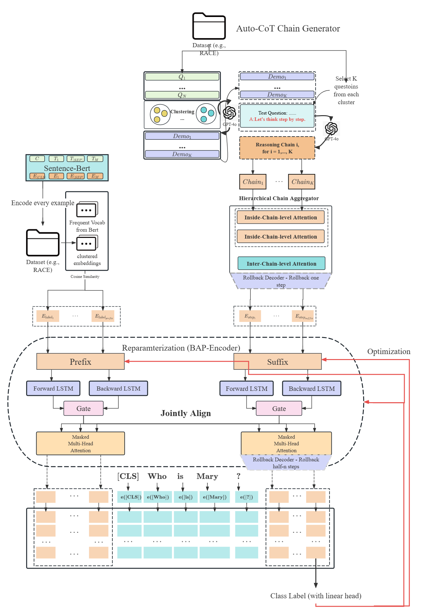
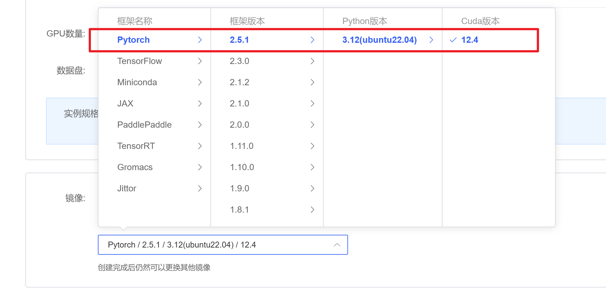
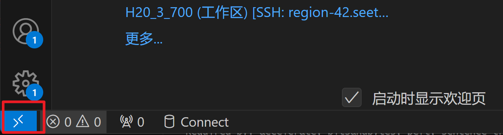
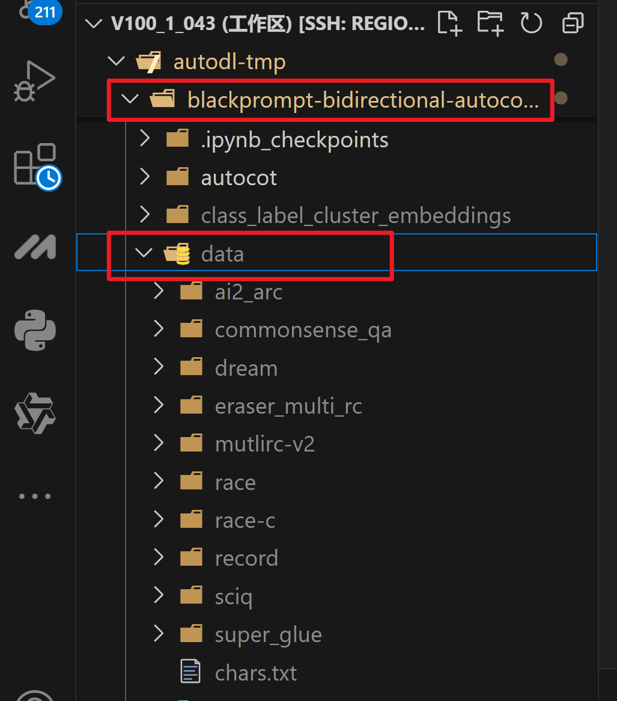
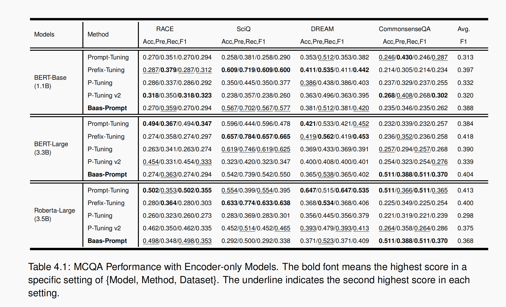

# 基于LoRA和Auto-CoT的双向prompt-tuning微调方法
# BlackPrompt: A Bidirectional and LoRA enhanced Auto-Chain-of-Thought-K-Means Style prompt-tuning system For multiple choice question answering

---

## Background
- 由于受到《Pretrained Prompt-Tuning》在**使用预训练来初始化prompt tokens**后大幅提高prompt-tuning性能的影响，我们希望找到一种方法，它不需要预训练prompt-tokens，而是仅仅通过使用AutoCoT生成对应问题的推理步骤，并且将这些步骤(steps)以某种方式(clustering)转化为tokens加到原始prompt的后面，来使此种方法的MCQ问答性能超越pre-trained prompt-tuning,并且所使用的显存和算力也大幅降低，更加适用于low-resource的教学场景。 


- prompt 分为hard prompt 和 soft prompt
- 我们会把Auto-Cot的steps处理成一种称为 `semi-hard prompt` 的东西： 由于这些token不是训练得到的，因此他们不是连续的continuous tokens， 他们的本质是从推理步骤中直接拿出来的hard tokens, 再对这些hard tokens取平均。
  
- 但是从过往的经验看，soft-prompt的性能往往超越hard-prompt, 因此我们希望在此基础上prompt-tokens的部分进行微调，目的是在hard-prompt的基础上增加连续性。


---

## Contributions:
We propose a novel bidirectional prompt tuning method that injects a pair of jointly aligned prefix and suffix embeddings into the input layer of the model to from a prompt template of **`[Prefix;Input;Suffix]`**. Where the prefix is initialized using the topic labels from the training set and the suffix are initialized using a global reasoning chain is marged from $K$ local chains using a **`Chain Aggregator`** . This new method can be comparable or surpass all of the prompt-based baselines (Lester et al. 2021;
Li and Liang 2021; Liu et al. 2024; Liu et al. 2021) on the Bert model series, leading by a largest margin of 8.1 average F1 points without relying on pre-trained soft tokens (Gu et al., 2021).

We also introduce a new reparameterization encoder called **`BAP-Encoder`** that can leverage a pair of Bi-LSTMs to bidirectionally encode the prefix and suffix separately and use a cross-attention to jointly align the prefix and suffix to mitigate the deviation and inconsistency toward the task content.

We demonstrate that BaasPrompt outperforms existing single-layer prompt-based methods (Lester
et al. 2021; Liu et al. 2024) on all the experimented MCQ datasets, with a largest gap of 32.1-points of precision and 29-points of F1 on the SciQ, and can also be comparable to or even execeed the deep prompting method like prefix-tuning (Li and Liang, 2021) and p-tuning v2 (Liu et al., 2021).

---


## System Overview



---

## 评价指标
Accuracy, Precision, Recall, F1 Score

## 实验配置
### 模型
1. GPT2, GPT2-Medium
3. bert-base, bert-large, roberta
4. GPT-4o (only for the Auto-CoT)
  - 你需要一个OpenAI的API-KEY, 并且提前写入到系统的环境变量中：对于linux系统，建议直接写入.bashrc文件中, 免得每次开机都要重新配一遍。
```shell
vim ~/.bashrc
# 然后在文件最下方写入：
export OPENAI_API_KEY="... YOUR API KEY ..."
# 然后保存退出，然后在命令行中输入：
source ~/.bashrc
```


### Pytorch & CUDA
1. pytorch: 2.5.0
2. cuda: 12.2

### Machines & GPUs
1. 首先登录 https://www.autodl.com/ ， 注册一个账号。
2. 点击`算力市场`, 在 `选择地区`这一行再点击 `V100`专区，进去以后，`GPU数量至少选2（项目默认使用分布式训练）` 。
3. 镜像选择:
  -  `社区镜像`：pytorch和cuda的版本号和我的项目完全匹配，但是系统存储自带很多项目和缓存，需要自己动手清理，不清理可能会在tokenize的过程中提示内存不足。
  
  - `基础镜像`：版本号：pytorch:2.5.1, cuda:12.4. 基本匹配，但我没试过。
  

4. 等待主机初始化完成，然后点击运行，进入IDE界面后，建议使用VSCode的Remote-SSH插件， 然后在VSCode中点击左下角的蓝色按钮，然后在下拉菜单中点击 "连接到主机 Remote-SSH"，跟随提示一直按回车就行，直到输入主机名和密码。
 

 5. 进入主机后， 将项目代码文件夹直接从你自己的电脑上拖到云主机的 ~/autodl-tmp/ 目录下
 6. 将所有数据集拖到项目目录内的data文件夹下 (如果原来就有那就不用拖了)。


## 生成 `requirements.txt` 文件 （有可能不准确，不推荐做）
```shell
pip install pipreqs
pipreqs . --force
```

## 安装项目依赖
### 方法1
```shell
# 首先cd到项目根目录，然后执行以下命令：
pip install -r requirements.txt
```

### 方法2（最稳健的方法，但是可能缺少若干包，你可以先把脚本跑起来，通过报错来寻找缺少的包）
```shell
# 使用项目根目录中的badouai.yaml配置文件，创建一个新的conda环境
conda env create --file badouai.yml
```


## 运行项目
### 配置 accelerator 的 config 文件
注：如果你使用的是2xGPU, 请把Accelerate的配置文件替换为 default_config.yaml (双卡专用)，
如果是3xGPU, 请把配置文件替换为 three_gpu.yaml (3卡专用), 如果是4张，请替换为 four_gpu.ymal, 如果是4张以上，请自己在控制台输入`accelerator config`, 然后根据提示创建一个新的配置文件 (请按照我的案例进行配置)。
```yaml
compute_environment: LOCAL_MACHINE
debug: false
distributed_type: MULTI_GPU
downcast_bf16: 'no'
enable_cpu_affinity: false
gpu_ids: all
machine_rank: 0
main_training_function: main
mixed_precision: 'no'
num_machines: 1
num_processes: 4
rdzv_backend: static
same_network: true
tpu_env: []
tpu_use_cluster: false
tpu_use_sudo: false
use_cpu: false
```

### 运行Baas-Prompt和所有baselines
```shell
cd /path/to/this/project/blackprompt-bidirectional-autocot-prompt-tuning/

# 运行Baas-Prompt


# 运行Prompt-Tuning


# 运行P-Tuning


# 运行 P-Tuning V2


# 对 Suffix Length 进行 Ablation Study:


# 对 Prefix Initialization Method 进行 Ablation Study:


```


## 实验结果



